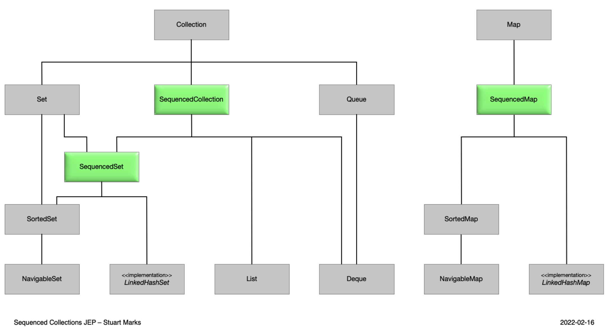

새로운 컬렉션 인터페이스가 정의 되었다.

sequenced collection, sequenced sets, sequenced maps

자바의 컬렉션 프레임워크에는 만남 순서를 가진 요소의 시퀀스를 나타내는 컬렉션 유형이 없었다.

첫번째와 마지막이 있고, 순서대로 또는 역순으로 엑세스 할 수 있는 균일한 API를 제공하게 되었다.



```java
interface SequencedMap<K,V> extends Map<K,V> {
    // new methods
    SequencedMap<K,V> reversed();
    SequencedSet<K> sequencedKeySet();
    SequencedCollection<V> sequencedValues();
    SequencedSet<Entry<K,V>> sequencedEntrySet();
    V putFirst(K, V);
    V putLast(K, V);
    // methods promoted from NavigableMap
    Entry<K, V> firstEntry();
    Entry<K, V> lastEntry();
    Entry<K, V> pollFirstEntry();
    Entry<K, V> pollLastEntry();
}

interface SequencedCollection<E> extends Collection<E> {
    // new method
    SequencedCollection<E> reversed();
    // methods promoted from Deque
    void addFirst(E);
    void addLast(E);
    E getFirst();
    E getLast();
    E removeFirst();
    E removeLast();
}

interface SequencedSet<E> extends Set<E>, SequencedCollection<E> {
    SequencedSet<E> reversed();    // covariant override
}
```