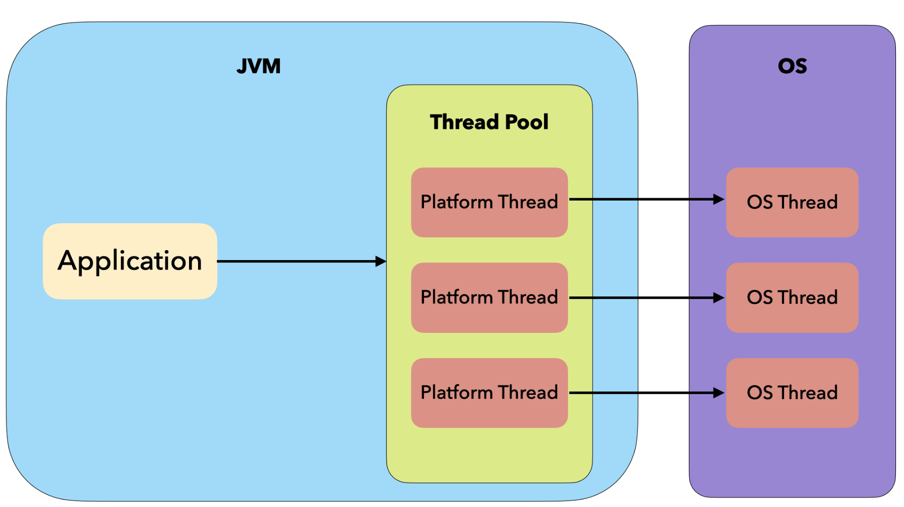
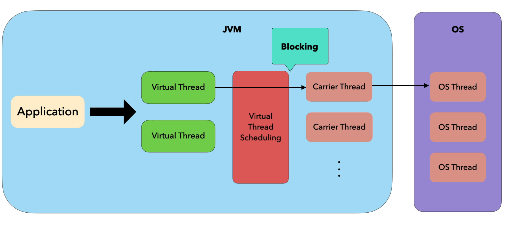
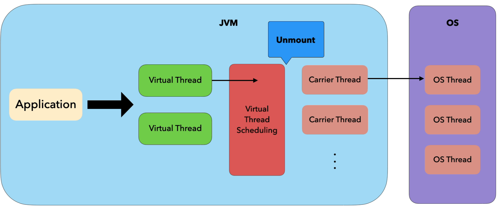
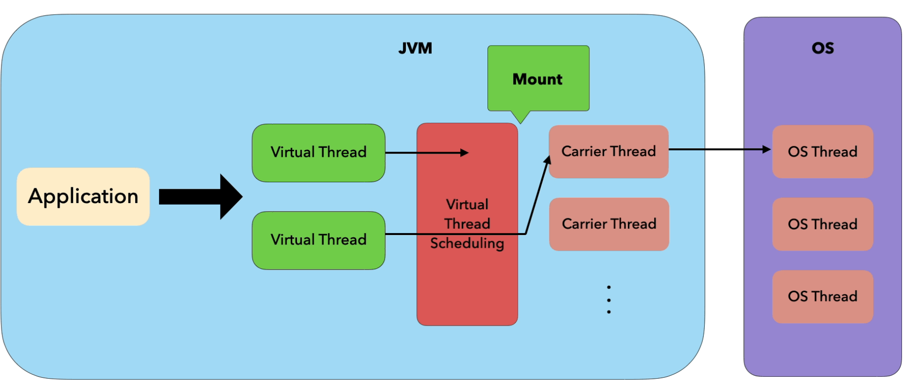
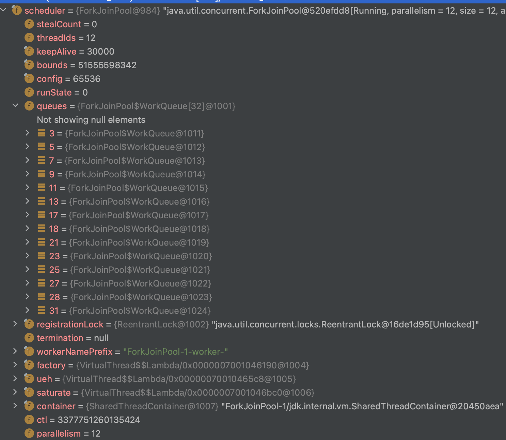
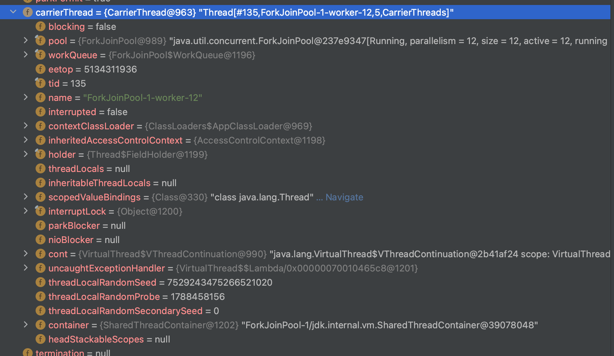
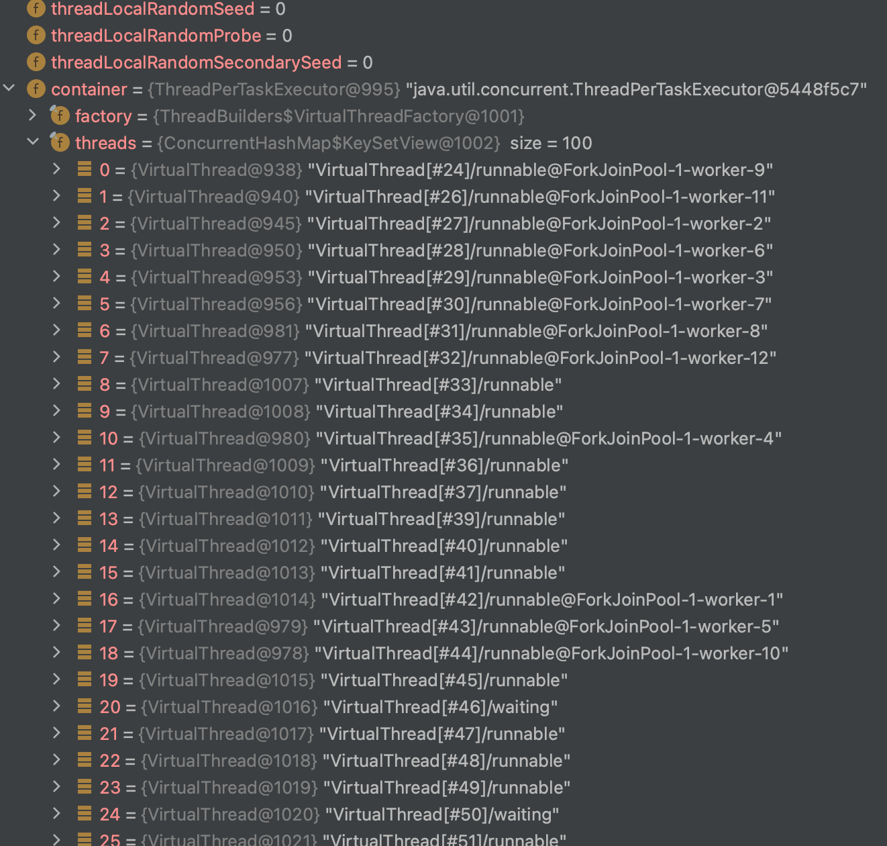
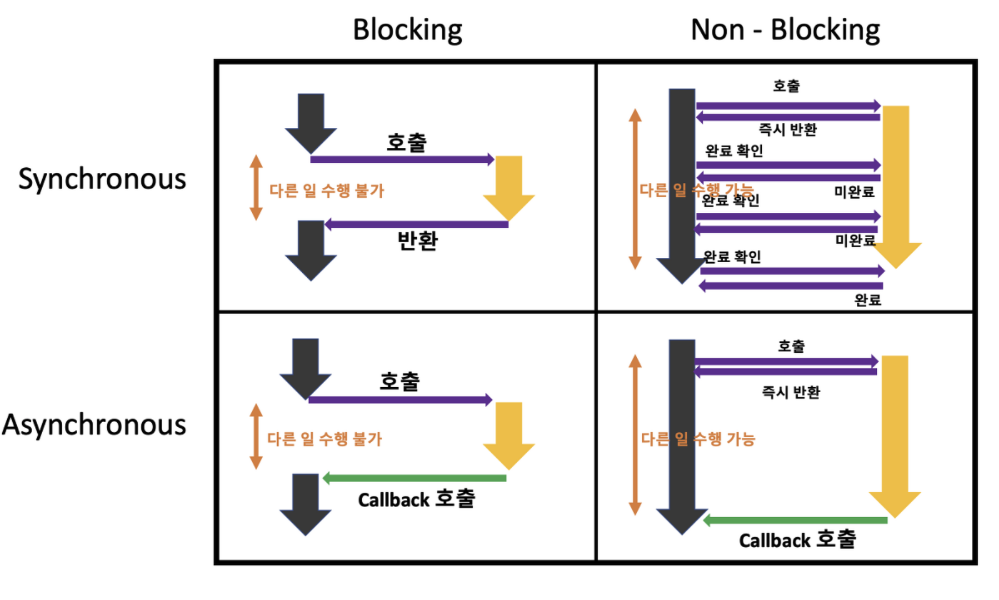

### Summary

`Virtual threads` 는 경량 스레드로써 높은 처리량의 concurrent applications을 작성하고, 유지보수 및 관찰하는 노력을 드라마틱하게 줄여준다.

### History

*   `Virtual threads` 는 JEP 425에서 preview feature로 제안되었고, JDK 19에서 제공 되었다.
    
*   피드백과 경험의 시간을 갖기 위해 JEP 436에서 preview feature로 다시 제안되었고, JDK 20에서 제공 되었다.
    
*   현재의 JEP 444에서 `Virtual threads` 가 JDK 21에서 마무리 됨을 제안하고 있다.
    
*   자바의 동시성 처리 개선을 위해 Ron Pressler의 제안으로 2017년 시작된 Project Loom의 결과물이다.
    

\*\* JEP(Java Enhancement Proposal): 자바 기술을 강화하기 위한 제안 문서

* * *

### Background

*   전통적인 자바의 스레드는 **OS 스레드**를 wrapping 한 **플랫폼 스레드**를 사용한다.  
    OS 스레드는 갯수가 제한적이고 생성, 유지 비용이 비싸다. (feat. context switching)  
    이 때문에 **Thread Pool**을 만들어서 사용해 왔다.
    
*   기본적인 사용자 요청 처리 방식은 **Thread Per Request** 이다. 요청 당 하나의 스레드를 사용한다.  
    Thread Pool 에서 감당할 수 범위를 넘을 수 없다.
    
*   Thread Per Request 모델에서는 IO 작업 처리시 **Blocking**이 일어난다.  
    이 때문에 **Non-blocking** 방식의 **비동기 프로그래밍**이 발전했다.  
    비동기 프로그래밍은 적은 수의 OS 스레드를 여러 요청에서 같이 사용함으로써 더 나은 성능을 제공한다.  
    

*   **비동기 프로그래밍의 단점**
    
    *   [Why Continuations are Coming to Java](https://www.infoq.com/presentations/continuations-java/) (by Project Loom의 리더인 Ron Pressler)
        
    *   **제어 흐름을 잃는다**
        
        *   비동기 프로그래밍을 하다 보면 조건 분기, 반복문 등의 간단한 제어 흐름을 복잡하게 구성해야 하는 경우가 생긴다.  
            콜백 헬이 발생하게 되기도 한다.  
            (콜백 헬을 개선한) Future, Promise, Reactive streams 에서도 부가적인 코드가 많이 포함되게 된다.  
            비동기 코드는 대규모 개발자들이 하기에 많은 비용이 발생한다.
            
    *   **컨텍스트를 잃는다**
        
        *   비동기 프로그래밍에서는 스레드를 넘나들며 요청이 처리되므로 Context가 Stack Trace에 쌓이지 않는다.  
            (스택 트레이스를 부분 복구해 정보를 제공하기도 하는 듯 하나 자연스럽지 않다.)
            
    *   **전염성**
        
        *   예를 들어 한 메소드가 Future를 반환하면 이를 사용하는 다른 메서드도 Future를 반환해야 한다.  
            이러한 방식은 특정 패러다임을 강제하게 된다.
            
    *   async, await 또는 코틀린의 suspend 를 통해 동기적으로 코드를 작성하게 해서 제어 흐름을 잃는 문제를 해결해 준다.  
        하지만 동기 함수에서 비동기 함수를 호출할 때 제약이 따르기 때문에 결국에는 대부분의 함수가 async, await, suspend 구문을 가지게 된다. (결국 전염성)  
        또한 비동기 함수에서 블로킹 IO 함수를 호출하는지 계속 신경써야 하는 것도 불편한 점이다. (결국 전염성)
        

*   자바 플랫폼은 전통적으로 스레드를 중심으로 구성되어 있다.  
    (라이브러리들 모두 비동기 프로그래밍 방식으로 새롭게 작성해야 하는 문제가 생긴다)  
    스레드 호출 스택은 thread local을 사용해 데이터와 컨텍스트를 연결하도록 설계되어 있다  
    Exception, Debugger, Profile(JFR) 모두 스레드 기반이다.
    

* * *

### Goals

*   Thread Per Request 모델에서 하드웨어 성능을 잘 활용하여 높은 처리량을 달성
    
*   기존의 자바 플랫폼의 최소한의 변경
    
*   기존 JDK 툴을 사용해 디버깅, 프로파일링을 지원할 것
    

### 플랫폼 스레드와 Virtual Thread 구조 차이



### Resource

Virtual Thread는 수백만개까지 늘어날 수 있도록 설계 되었기 때문에 플랫폼 스레드와 자원 사용량에 차이가 있다.

| 
 | 

**플렛폼 스레드**

 | 

**Virtual Thread**

 |
| --- | --- | --- |
| 

meta data size

 | 

약 2kb by OS

 | 

200-300 B

 |
| 

memory

 | 

미리 할당된 stack 사용

 | 

Heap

 |
| 

context switching cost

 | 

1-10us

 | 

ns(or 1ns 미만)

 |

### _Observing_

JDK는 오랫동안 디버깅, 프로파일링, 모니터링 하는 메커니즘을 제공해 왔으며 virtualThread도 동일하게 작동하도록 했다.  
스레드 덤프의 경우, virtualThread는 수백만개가 있을 수 있어 적합하지 않다.  
따라서 새로운 종류의 스레드 덤프를 jcmd에 도입할 예정이다.

Thread.currentThread()는 항상 virtualThread 이다.  
캐리어와 virtualThread는 별개여서 서로의 스택 트레이스를 가지고 있지 않다.

### _Scheduling_

작업을 수행하려면 프로세서 코어에서 실행되어야 하므로 virtualThread는 할당 되어야 한다.  
OS 스레드에 할당되는 플랫폼 스레드는 OS의 스케쥴러에 의존하지만 virtualThread는 JDK 자체에 스케쥴러가 있다.  
자체 스케쥴러는 virtualThread를 프로세서에 직접 할당하는게 아니라 플랫폼 스레드에 할당한다.  
자체 스케쥴러가 virtualThread를 할당하는 플랫폼 스레드를 캐리어 스레드라고 한다.  
플랫폼 스레드의 수는 기본적으로는 프로세서의 수와 동일하지만 시스템 속성 변경으로 조정이 된다고 한다.  
(예제의 경우 12개)

### Test

```java
final long start = System.currentTimeMillis();
final AtomicLong index = new AtomicLong();
final int count = 100; // 총 100개
final CountDownLatch countDownLatch = new CountDownLatch(count);

final Runnable runnable = () -> {
  try {
      final long indexValue = index.incrementAndGet();
      Thread.sleep(1000L); // 1초 블라킹 코드
      log.info("\nthreadName: " + Thread.currentThread().getName() + "\nvalue: " + indexValue);
      countDownLatch.countDown();
  } catch (final InterruptedException e) {
      countDownLatch.countDown();
  }
};

// 쓰레드 풀 10개 사용시
try (final ExecutorService executorService = Executors.newFixedThreadPool(10)) {
  for (int i = 0; i < count; i++) {
      executorService.submit(runnable);
  }
}

countDownLatch.await();
final long finish = System.currentTimeMillis();
final long timeElapsed = finish - start;

log.info("\nthreadName: " + Thread.currentThread().getName() + "\nRun time: " + timeElapsed);
```

```java
Run time: 10117 # 10초 
```

```java
// virtual thread로 변경
Executors.newFixedThreadPool(10) -> Executors.newVirtualThreadPerTaskExecutor()
```

```java
Run time: 1083 # 1초 
```



*   12개의 캐리어 스레드지만 1초만에 연산이 종료되었다
    
*   플랫폼 스레드만 사용했을 땐 10초가 걸렸다
    

#### Source

*   virtual thread 상태값이 다양하다
    

```java
// virtual thread state, accessed by VM
private volatile int state;

/*
  * Virtual thread state and transitions:
  *
  *      NEW -> STARTED         // Thread.start
  *  STARTED -> TERMINATED      // failed to start
  *  STARTED -> RUNNING         // first run
  *
  *  RUNNING -> PARKING         // Thread attempts to park
  *  PARKING -> PARKED          // cont.yield successful, thread is parked
  *  PARKING -> PINNED          // cont.yield failed, thread is pinned
  *
  *   PARKED -> RUNNABLE        // unpark or interrupted
  *   PINNED -> RUNNABLE        // unpark or interrupted
  *
  * RUNNABLE -> RUNNING         // continue execution
  *
  *  RUNNING -> YIELDING        // Thread.yield
  * YIELDING -> RUNNABLE        // yield successful
  * YIELDING -> RUNNING         // yield failed
  *
  *  RUNNING -> TERMINATED      // done
  */
private static final int NEW      = 0;
private static final int STARTED  = 1;
private static final int RUNNABLE = 2;     // runnable-unmounted
private static final int RUNNING  = 3;     // runnable-mounted
private static final int PARKING  = 4;
private static final int PARKED   = 5;     // unmounted
private static final int PINNED   = 6;     // mounted
private static final int YIELDING = 7;     // Thread.yield
private static final int TERMINATED = 99;  // final state

// can be suspended from scheduling when unmounted
private static final int SUSPENDED = 1 << 8;
private static final int RUNNABLE_SUSPENDED = (RUNNABLE | SUSPENDED);
private static final int PARKED_SUSPENDED   = (PARKED | SUSPENDED);
```

*   Thread.sleep
    
    *   내부에서 Virtual Thread인지 판단하고 있다
        

```java
public static void sleep(long millis) throws InterruptedException {
    if (millis < 0) {
        throw new IllegalArgumentException("timeout value is negative");
    }

    long nanos = MILLISECONDS.toNanos(millis);
    ThreadSleepEvent event = beforeSleep(nanos);
    try {
        // *************
        if (currentThread() instanceof VirtualThread vthread) {
            vthread.sleepNanos(nanos);
        } else {
            sleep0(nanos);
        }
    } finally {
        afterSleep(event);
    }
}
```

*   sleepNanos() → parkNanos() → unmount()… 순서로 호출되면서 virtual thread를 block 시키고, 지정한 시간이 지나면 mount() 를 통해 virtual thread를 깨워서 다시 진행한다.
    
*   해당 virtualThread의 carrierThread는 currentThread에 본인 스스로가 세팅 되면서 VirtualThread의 남은 연산을 수행하게 되는 것 같다
    

```java
private void unmount() {
    // set Thread.currentThread() to return the platform thread
    Thread carrier = this.carrierThread;
    carrier.setCurrentThread(carrier);

    // break connection to carrier thread, synchronized with interrupt
    synchronized (interruptLock) {
        setCarrierThread(null);
    }
    carrier.clearInterrupt();
}
```

* * *

### Test

```java
@GetMapping("/")
public String noneBlocking() {
    // no blocking
    return Thread.currentThread().toString();
}

@GetMapping("/block")
public String blocking() throws InterruptedException {
    // blocking
    Thread.sleep(1000);
    return "OK";
}
```

```java
spring:
  threads:
    virtual:
      enabled: true # spring 3.2 부터 해당 옵션으로 on/off 가능하다 
```

#### #1

*   number of threads (users) : 3000
    
*   ramp up period: 5
    
*   mac book M2 pro / intelliJ / Heap 2G
    
> /, /block    
vitual thread
499, 428  
platform thread
499, 194


#### #2

*   number of threads (users) : 3000
    
*   ramp up period: 2
    
> /, /block    
vitual thread
995, 749  
platform thread
999, 196

*   blocking이 없을 때는 성능에 큰 차이가 없다
    
*   blocking이 있을 때는 성능에 차이가 크다
    

#### #3 한정된 자원을 만났을 때

```java
@GetMapping("/query")
public String queryAndReturn() {
    // 쿼리가 1초 걸린다고 가정
    return jdbcTemplate.queryForList("select sleep(1);").toString();
}
```
> /query, vitual thread, platform thread  
users: 3000
ramp: 5 
hikari.maximum-pool-size: 100, 11, 92  
users: 3000
ramp: 10 
hikari.maximum-pool-size: 100, 11, 92  
users: 3000
ramp: 10
hikari.maximum-pool-size: 150, 11, 129


*   virtual thread의 경우 request 수가 많더라도 worker 스레드가 코어 수 만큼 생겨서 throughtoutput이 적은 것으로 보인다
    
*   platform thread의 경우 thread pool default가 200이므로 max connection 만큼의 throughtoutput 을 내는 것으로 보인다
    

* * *

### 그 외

*   MDC 도 잘 동작한다. (cf. @Async 어느테이션을 사용하면 스레드가 달라져 유지되지 않음)
    
*   이전 JEP 에서는 아래의 문제가 있었는데 이번에 해결이 된 것일까? → 조심해서 써야 한다
    
    *   JNI 같은 native method 를 호출하는 경우 Blocking IO를 만나도 다른 virtualThread로 yield하지 않음
        
    *   synchronized block을 만나는 경우 blocking IO를 만나도 다른 virtualThread로 yield하지 않음
        
*   스레드 풀은 여느 리소스 풀과 마찬가지로 값비싼 리소스를 공유하기 위한 것인데, virtualThread는 비싼 리소스가 아니므로 풀링할 필요가 없다.
    
*   goroutine, coroutine 과 다른 컨셉. 범위가 점점 커져서 패스…
    



### references

[https://openjdk.org/projects/jdk/21/](https://openjdk.org/projects/jdk/21/)

[https://findstar.pe.kr/2023/04/17/java-virtual-threads-1/](https://findstar.pe.kr/2023/04/17/java-virtual-threads-1/)

[http://gunsdevlog.blogspot.com/2020/09/java-project-loom-reactive-streams.html](http://gunsdevlog.blogspot.com/2020/09/java-project-loom-reactive-streams.html)

[https://earth-95.tistory.com/m/194](https://earth-95.tistory.com/m/194)

[https://perfectacle.github.io/2022/12/29/look-over-java-virtual-threads/](https://perfectacle.github.io/2022/12/29/look-over-java-virtual-threads/)

[https://inpa.tistory.com/entry/%F0%9F%91%A9%E2%80%8D%F0%9F%92%BB-%EB%8F%99%EA%B8%B0%EB%B9%84%EB%8F%99%EA%B8%B0-%EB%B8%94%EB%A1%9C%ED%82%B9%EB%85%BC%EB%B8%94%EB%A1%9C%ED%82%B9-%EA%B0%9C%EB%85%90-%EC%A0%95%EB%A6%AC](https://inpa.tistory.com/entry/%F0%9F%91%A9%E2%80%8D%F0%9F%92%BB-%EB%8F%99%EA%B8%B0%EB%B9%84%EB%8F%99%EA%B8%B0-%EB%B8%94%EB%A1%9C%ED%82%B9%EB%85%BC%EB%B8%94%EB%A1%9C%ED%82%B9-%EA%B0%9C%EB%85%90-%EC%A0%95%EB%A6%AC)

[https://perfectacle.github.io/2023/07/10/java-virtual-thread-vs-kotlin-coroutine/](https://perfectacle.github.io/2023/07/10/java-virtual-thread-vs-kotlin-coroutine/)

[https://www.baeldung.com/spring-6-virtual-threads](https://www.baeldung.com/spring-6-virtual-threads)